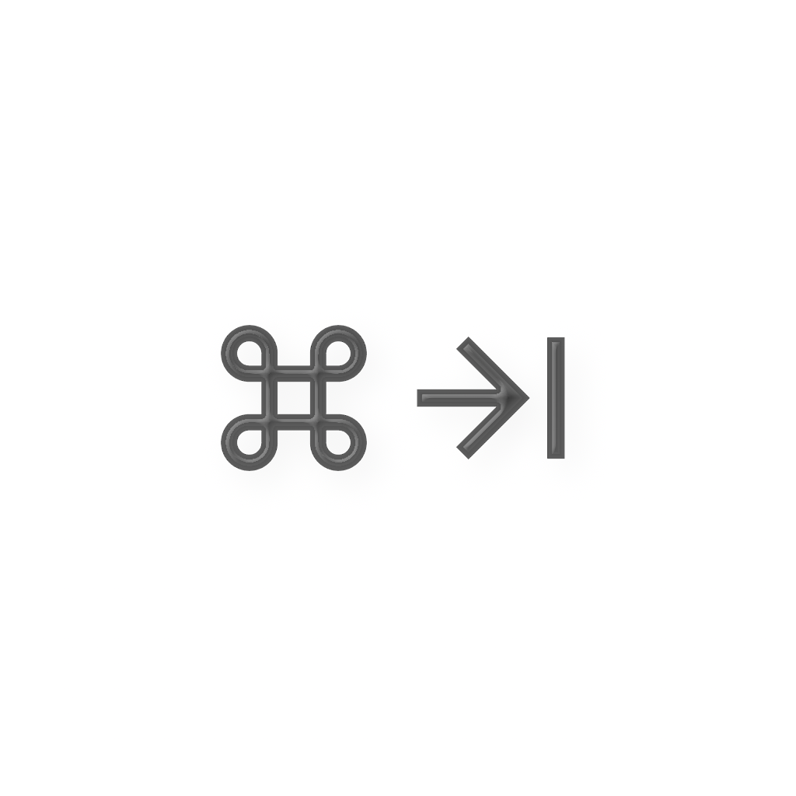

  

<h1 align="center">Command Reopen</h1>

  <strong>Fix Cmd+Tab for minimized and closed windows on macOS.</strong>

  Cmd+Tab to an app with a minimized or closed window — and nothing happens. Command Reopen makes the native Cmd+Tab restore those windows, the way it should have always worked.

  

  Prefer a free build? Grab the DMG from <a href="https://github.com/Feng6611/mac-command-reopen/releases">GitHub Releases</a> · <a href="https://commandreopen.com">Landing</a> · <a href="README_CN.md">中文</a>

## Features

- **Restore minimized and closed windows** with Cmd+Tab — if an app has no open windows, a new one is created automatically
- **Zero permissions** — no Accessibility, no Screen Recording, nothing
- **Native switcher preserved** — works invisibly behind the stock Cmd+Tab UI
- **Configurable exclude list** for apps you don't want restored
- **Lightweight** menu bar app, <2 MB, near-zero CPU
- **Open source** (MIT) and fully auditable

## macOS Window Shortcuts You Should Know

| Shortcut | Action |
|---|---|
| `Cmd+Tab` | Switch between apps |
| `` Cmd+` `` | Switch windows within the same app |
| `Cmd+H` | Hide current app (Cmd+Tab brings it back) |
| `Cmd+M` | Minimize current window to Dock |
| `Cmd+W` | Close current window |
| `Cmd+Option+H` | Hide all other apps |
| `Cmd+Tab` → hold `Option` → release `Cmd` | Restore one minimized window (native workaround) |

Notice the gap? **Cmd+H** (Hide) works perfectly with Cmd+Tab — the window comes right back. But **Cmd+M** (Minimize) and **Cmd+W** (Close) don't — Cmd+Tab switches to the app but the window stays gone.

That's exactly what Command Reopen fixes. Every Cmd+Tab switch restores your windows automatically.

## How It Works

Command Reopen listens for app activation events via `NSWorkspace.didActivateApplicationNotification`. When you Cmd+Tab to an app, it first checks whether that app already has a visible on-screen window by inspecting the public CoreGraphics window list (`CGWindowListCopyWindowInfo`). Only if no visible window is found does it send a restore request through `NSWorkspace.openApplication(at:configuration:)`. This brings back minimized windows and recreates closed ones — all using standard macOS APIs that require no special permissions.

The core logic is ~300 lines in a single file: [ActivationMonitor.swift](ComTab/ActivationMonitor.swift).

## FAQ

**Why does Cmd+Tab not restore minimized windows?**

macOS treats minimized windows as intentionally "put away." Cmd+Tab switches the active application but does not restore minimized windows by design. The only native workaround is Cmd+Tab → hold Option → release Cmd, which restores only one window at a time — and most users don't know it exists.

**Does Command Reopen need any permissions?**

No. It uses `NSWorkspace` APIs available to sandboxed apps. No Accessibility permission, no Screen Recording, no special entitlements.

**Does it change the Cmd+Tab interface?**

No. The native Cmd+Tab switcher stays exactly the same. Command Reopen works invisibly behind it — you won't notice any visual difference.

**Can it reopen windows that were closed, not just minimized?**

Yes. If you Cmd+Tab to an app that has no open windows, Command Reopen will create a new window automatically.

## Privacy

Command Reopen collects no data. Everything runs locally on your Mac. See [PRIVACY.md](PRIVACY.md).

## License

[MIT](LICENSE)
