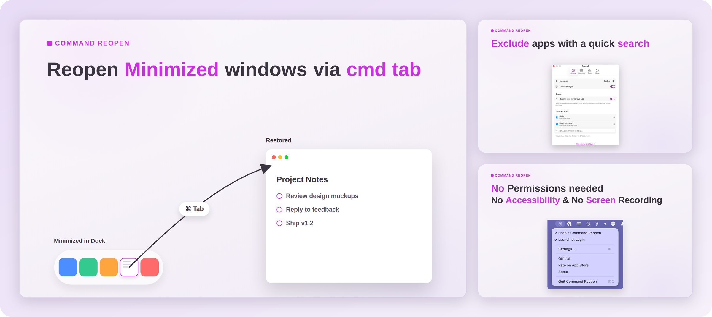

<p align="center">
  
</p>

<h1 align="center">Command Reopen</h1>

<p align="center">
  <strong>Make Cmd+Tab bring back minimized and closed windows.</strong>
</p>

<p align="center">
  You Cmd+Tab to an app, it becomes active — and its window stays in the Dock. Command Reopen fixes that inside the native switcher, with zero permissions.
</p>

<p align="center">
  <a href="https://apps.apple.com/app/apple-store/id6757333924?pt=128417926&ct=readme&mt=8">
    
  </a>
</p>

<p align="center">
  <sub><a href="https://commandreopen.com">Website</a> · <a href="README_CN.md">中文</a></sub>
</p>

<p align="center">
  
</p>

## The Cmd+Tab gap

| Shortcut | What happens | Does Cmd+Tab bring it back? |
|---|---|---|
| `Cmd+H` | Hides the app | Yes |
| `Cmd+M` | Minimizes the window to the Dock | **No** |
| `Cmd+W` | Closes the window | **No** |

Hide an app and Cmd+Tab brings it right back. Minimize or close its window and Cmd+Tab only activates the app — the window stays gone, and you reach for the mouse. The one native workaround (Cmd+Tab, hold Option, release Cmd) restores a single window, and few people know it exists.

Command Reopen closes that gap. Every Cmd+Tab switch lands on a window.

## Features

- **Minimized windows come back** — switch to an app and its minimized window leaves the Dock on its own.
- **Closed windows reopen** — if you closed the app's last window, switching to it opens a fresh one.
- **Focus returns when the last window goes** — close or minimize an app's last window and focus moves to the previous app, so the next Cmd+Tab brings it back.
- **The native switcher stays** — no launcher, window manager, or custom switcher. Same Cmd+Tab, same muscle memory.
- **Exclude any app** — search by name or bundle ID; excluded apps keep the standard Cmd+Tab behavior.
- **Quiet in the background** — a small menu bar app, under 5 MB, near-zero CPU. Hide the menu bar icon if you prefer.

## Zero permissions

- **No Accessibility** permission.
- **No Screen Recording** permission.
- **Sandboxed** and distributed through the Mac App Store.
- **No tracking** — everything runs on your Mac.

Most window tools need Accessibility to move windows around. Command Reopen doesn't, because it never touches another app's windows directly. It listens for app activation with `NSWorkspace.didActivateApplicationNotification`, checks the public CoreGraphics window list (`CGWindowListCopyWindowInfo`) for a visible window, and only when there is none asks the app to reopen through `NSWorkspace.openApplication(at:configuration:)` — the same request macOS sends when you click an app's Dock icon.

You don't have to take my word for it: the source is MIT-licensed, and the reopen logic lives in [CmdReopen/Features/Reopen](CmdReopen/Features/Reopen).

## Install

**[Download Command Reopen on the Mac App Store](https://apps.apple.com/app/apple-store/id6757333924?pt=128417926&ct=readme&mt=8)** — requires macOS 13 Ventura or later.

Open it once and it runs from the menu bar. Turn on Launch at Login in Settings to keep it running after a restart.

## FAQ

**Why doesn't Cmd+Tab restore minimized windows on a Mac?**

macOS treats a minimized window as deliberately put away, so Cmd+Tab activates the app and leaves the window in the Dock. The built-in workaround — Cmd+Tab, hold Option, then release Cmd — restores only one window at a time.

**Does Command Reopen need any permissions?**

No. It needs neither Accessibility nor Screen Recording permission. It uses `NSWorkspace` APIs that any sandboxed app can call.

**Does it change the Cmd+Tab switcher?**

No. The native switcher looks and works exactly as before; Command Reopen acts only after you pick an app.

**Can it reopen closed windows, not just minimized ones?**

Yes. If the app you switch to has no open windows, Command Reopen asks it to open a new one.

**Can I turn it off for certain apps?**

Yes. Add them to Excluded Apps in Settings and they keep the standard Cmd+Tab behavior.

## Privacy

Command Reopen keeps window handling and app-specific activity on your Mac and
does not collect or transmit product analytics. See [PRIVACY.md](PRIVACY.md).

## Building from source

```sh
./script/build_and_run.sh --verify
```

Signing, the App Store build configuration, and the code map are covered in [DEVELOPMENT.md](DEVELOPMENT.md).

## About

Built by [chenfeng](https://github.com/Feng6611) — I make small,
permission-light Mac utilities, plus a couple of Obsidian plugins:
[Open in Terminal](https://github.com/Feng6611/Obsidian-open-in-Teminal) and [File Ignore](https://github.com/Feng6611/Obsidian-File-Ignore).

## License

[MIT](LICENSE)
