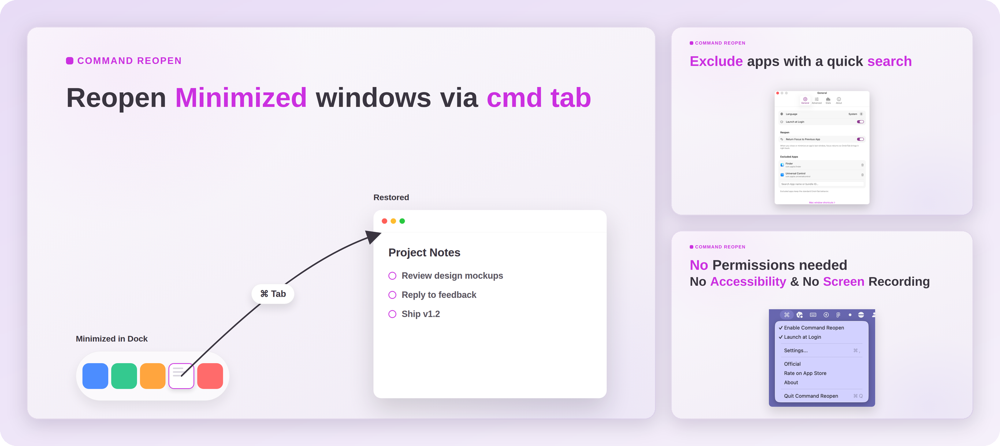

  

<h1 align="center">Command Reopen</h1>

  <strong>Bring back a window when you switch apps with Cmd+Tab.</strong>

  You Cmd+Tab to an app, it becomes active — and its window stays in the Dock. Command Reopen requests an app reopen when an application activates with no visible windows, using zero permissions inside the native switcher.

  

  <a href="https://commandreopen.com">Website</a> · <a href="README_CN.md">中文</a>

  

## The Cmd+Tab gap

| Shortcut | What happens | Does Cmd+Tab bring it back? |
|---|---|---|
| `Cmd+H` | Hides the app | Yes |
| `Cmd+M` | Minimizes the window to the Dock | **No** |
| `Cmd+W` | Closes the window | **No** |

Hide an app and Cmd+Tab brings it back immediately. Minimize or close its window, however, and Cmd+Tab only activates the application — leaving the window in the Dock or closed. The native workaround (Cmd+Tab, hold Option, then release Cmd) restores only one window at a time.

Command Reopen addresses this gap. When you switch to an app that has no visible windows, it requests a standard application reopen.

## Features

- **Restore minimized windows** — Switch to an app and Command Reopen requests a reopen event allowing the app to restore a minimized window from the Dock.
- **Reopen closed windows** — If an app has no open windows when you switch to it, Command Reopen requests a new default window.
- **Zero permissions** — Requires neither Accessibility nor Screen Recording permission. Sandboxed, distributed through the Mac App Store, with no tracking.
- **Return focus when the last window closes** — When you close or minimize an app's last window, focus shifts to your previous app so subsequent Cmd+Tab cycles stay natural.
- **Native switcher remains unchanged** — No custom switcher, overlay, or third-party window manager. You keep the standard Cmd+Tab behavior and muscle memory.
- **Exclude any app** — Filter apps by name or bundle identifier; excluded apps retain standard macOS Cmd+Tab behavior.
- **Quiet background utility** — Runs quietly from the menu bar, with the option to hide the menu bar icon.

## FAQ

**Why doesn't Cmd+Tab restore minimized windows on macOS?**

macOS treats minimized windows as intentionally set aside. Cmd+Tab activates the application but leaves the window in the Dock. The built-in workaround — Cmd+Tab, hold Option, release Cmd — restores only one window at a time.

**Does Command Reopen need any permissions?**

No. It requires neither Accessibility nor Screen Recording permissions because it uses public window information and the app's standard reopen behavior. It observes application activation using `NSWorkspace.didActivateApplicationNotification`, checks the public CoreGraphics window list (`CGWindowListCopyWindowInfo`) for an existing visible window, and only if none exists sends a reopen request via `NSWorkspace.openApplication(at:configuration:)` — the same request macOS sends when clicking an app's Dock icon. You can inspect the implementation in [CmdReopen/Features/Reopen](CmdReopen/Features/Reopen).

**Does it alter the Cmd+Tab switcher UI?**

No. The native switcher appears and functions exactly as before. Command Reopen acts only after you select an app.

**Can it reopen closed windows, not just minimized ones?**

Yes, if the application supports standard macOS reopen behavior. When you switch to an application with no visible windows, Command Reopen requests a reopen event, prompting supporting apps to open a new window.

**Does every switch guarantee a window appears?**

No. Command Reopen requests a standard reopen event only when an app has no visible windows. How the application responds depends on its own handling of standard reopen events (the same as clicking its Dock icon).

**Can I disable it for specific apps?**

Yes. Add them to Excluded Apps in Settings, and they will keep standard macOS Cmd+Tab behavior.

## Privacy

Command Reopen keeps window handling and app-specific activity on your Mac and does not collect or transmit product analytics. See [PRIVACY.md](PRIVACY.md).

## About

Built by [chenfeng](https://github.com/Feng6611) — I make focused, permission-light Mac utilities and Obsidian plugins, including [Open in Terminal](https://github.com/Feng6611/Obsidian-open-in-Teminal) and [File Ignore](https://github.com/Feng6611/Obsidian-File-Ignore).
