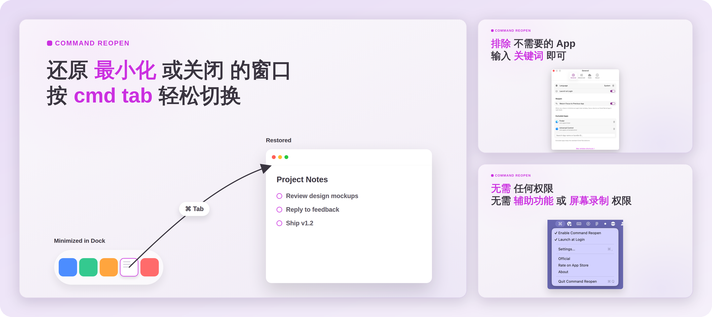

<p align="center">
  
</p>

<h1 align="center">Command Reopen</h1>

<p align="center">
  <strong>按 Cmd+Tab，最小化和关掉的窗口自己回来。</strong>
</p>

<p align="center">
  用 Cmd+Tab 切到某个应用，应用是激活了，窗口却还缩在程序坞里。Command Reopen 在原生切换器里把这件事补上，而且不要任何权限。
</p>

<p align="center">
  <a href="https://apps.apple.com/app/apple-store/id6757333924?pt=128417926&ct=readme&mt=8">
    
  </a>
</p>

<p align="center">
  <sub><a href="https://commandreopen.com">官网</a> · <a href="README.md">English</a></sub>
</p>

<p align="center">
  
</p>

## Cmd+Tab 缺的那一块

| 快捷键 | 效果 | Cmd+Tab 能切回来吗？ |
|---|---|---|
| `Cmd+H` | 隐藏应用 | 能 |
| `Cmd+M` | 窗口最小化到程序坞 | **不能** |
| `Cmd+W` | 关闭窗口 | **不能** |

隐藏的应用，Cmd+Tab 一按就回来了；可窗口一旦最小化或关掉，Cmd+Tab 只会激活应用，窗口不出来，最后还得伸手去点鼠标。系统倒是留了个办法：Cmd+Tab 选中后按住 Option 再松开 Cmd，但一次只能还原一个窗口，知道的人也不多。

Command Reopen 就是来补这一块的：每次 Cmd+Tab，切过去都有窗口。

## 功能

- **最小化的窗口自动还原**：切到应用，窗口自己从程序坞出来。
- **关掉的窗口重新打开**：最后一个窗口已经关了，切过去会新开一个。
- **最后一个窗口没了，焦点自动交还**：关掉或最小化应用的最后一个窗口后，焦点回到上一个应用，下次 Cmd+Tab 就能切回来。
- **原生切换器照旧**：不换启动器，不装窗口管理器，也没有自定义切换器。还是那个 Cmd+Tab，手感不变。
- **可以排除任意应用**：按名称或 Bundle ID 搜索添加，被排除的应用保持系统默认行为。
- **安静待在后台**：菜单栏小工具，不到 5 MB，几乎不占 CPU；嫌菜单栏挤，图标也能隐藏。

## 零权限

- **不要辅助功能权限**
- **不要屏幕录制权限**
- **沙盒运行**，通过 Mac App Store 分发
- **不追踪**，一切都在你的 Mac 上完成

大多数窗口工具要靠辅助功能权限去挪动窗口，Command Reopen 用不着，因为它从不直接碰别的应用的窗口。它通过 `NSWorkspace.didActivateApplicationNotification` 得知你切到了哪个应用，再用公开的 CoreGraphics 窗口列表（`CGWindowListCopyWindowInfo`）看看有没有可见窗口；只有一个都没有时，才通过 `NSWorkspace.openApplication(at:configuration:)` 请应用重新打开窗口——和你点一下程序坞图标时系统发出的请求是同一个。

不必只听我说：源代码以 MIT 协议公开，恢复逻辑就在 [CmdReopen/Features/Reopen](CmdReopen/Features/Reopen) 目录下。

## 安装

**[在 Mac App Store 下载 Command Reopen](https://apps.apple.com/app/apple-store/id6757333924?pt=128417926&ct=readme&mt=8)**，需要 macOS 13 Ventura 或更高版本。

打开一次后它就常驻菜单栏。想开机后自动运行，在设置里打开「登录时打开」即可。

## 常见问题

**为什么 Mac 上 Cmd+Tab 不能还原最小化的窗口？**

macOS 把最小化的窗口当作你有意收起来的，所以 Cmd+Tab 只激活应用，窗口留在程序坞里。系统自带的办法是 Cmd+Tab 选中后按住 Option 再松开 Cmd，但一次只能还原一个窗口。

**Command Reopen 需要什么权限？**

什么权限都不需要，辅助功能和屏幕录制都不用。它只调用沙盒应用本来就能用的 `NSWorkspace` API。

**它会改变 Cmd+Tab 切换器吗？**

不会。原生切换器的样子和用法都不变，Command Reopen 只在你选定应用之后才介入。

**关掉的窗口也能恢复，而不只是最小化的？**

能。切到的应用如果一个窗口都没有，Command Reopen 会请它新开一个。

**可以对某些应用关掉这个功能吗？**

可以。在设置里把它们加进「排除 App」，这些应用就保持系统默认的 Cmd+Tab 行为。

## 隐私

窗口处理和各应用的使用记录都只保存在你的 Mac 上，Command Reopen 不收集、也不上传任何产品分析数据。详见 [PRIVACY.md](PRIVACY.md)。

## 从源码构建

```sh
./script/build_and_run.sh --verify
```

签名、App Store 构建配置和代码结构说明见 [DEVELOPMENT.md](DEVELOPMENT.md)（英文）。

## 关于作者

我是 [chenfeng](https://github.com/Feng6611)，一个人做一些权限需求尽量少的 Mac 小工具，也写了两个 Obsidian 插件：
[Open in Terminal](https://github.com/Feng6611/Obsidian-open-in-Teminal) 和 [File Ignore](https://github.com/Feng6611/Obsidian-File-Ignore)。

## 许可证

[MIT](LICENSE)
